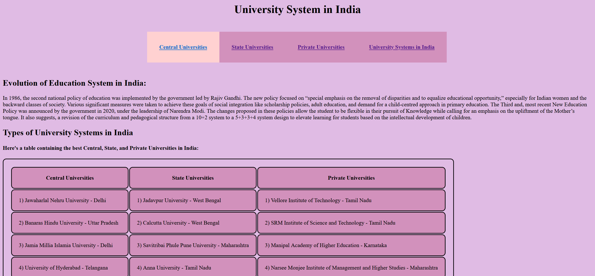

# University-Systems-In-India
A collection of HTML &amp; CSS codes that are required to create a funtioning website on the University Systems in India

It includes the following pages. 

1) US Main Page: The home page of the website. Includes tabs to go to other pages, along with a brief history of the education system in india and a table of various top colleges in the country.

2) Central Universities: This page consists of information on the evolution of central university system in India as well as information on some of the best central universities in the country.

3) State Universities: This page consists of information on the evolution of state university system in India as well as information on some of the best state universities in the country.

4) Private Universities: This page consists of information on the evolution of private university system in India as well as information on some of the best private universities in the country.

5) University Systems: This page consists of information on some of the special university systems in India that consist of IITs, IIM's, NIT's, etc.

